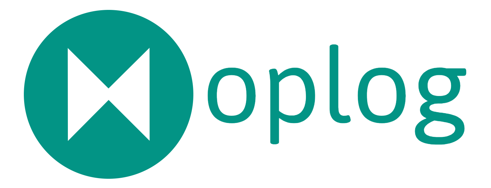

# Welcome to oplog

## What is oplog?

!!! warning

    oplog is currently in beta. At this point, we expect the API to be stable and core functionality to be working as expected. However, there are still some features that you may find missing. If you have any feedback, please open an issue.

oplog is a modern logging library for Python application.
oplog offers a different paradigm for logging, which is based on the concept of logging operations.
Instead of creating a "log-book", which is a long scroll of text messages, oplog is about logging operations with rich data.

## Key features

1. **Object Oriented**: Intuitive API, easy to use and extend.
2. **Modern & Scalable**: Unlike log messages, oplog is scaleable. Ingesting oplogs to a columnar database allows you to query, analyze and monitor your app in a modern and performant way.
3. **Standardized**: No more mess and inconsistency across your logs. oplog creates a standard for how logs should be written across your code base. Clean code, clean logs.
4. **Production Ready**: Easily create dashboards and monitors on top of logged data.
5. **Lightweight**: oplog is a layer on top of the standard Python logging library. It is easy to integrate and use.
6. **Minimal**: While oplog is rich with metadata, you only log what you need. Creating smaller and more efficient logs.